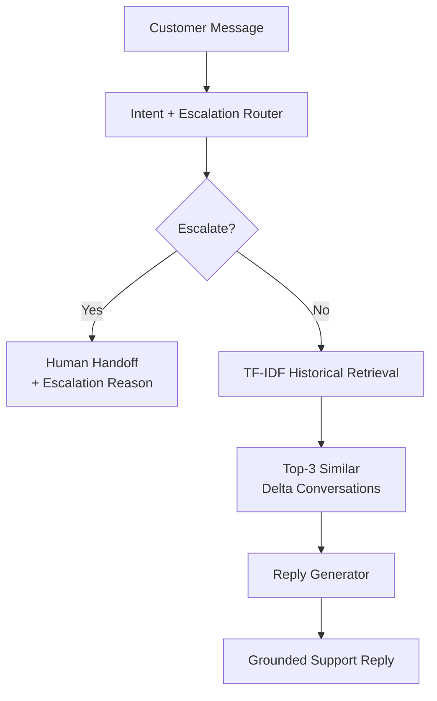
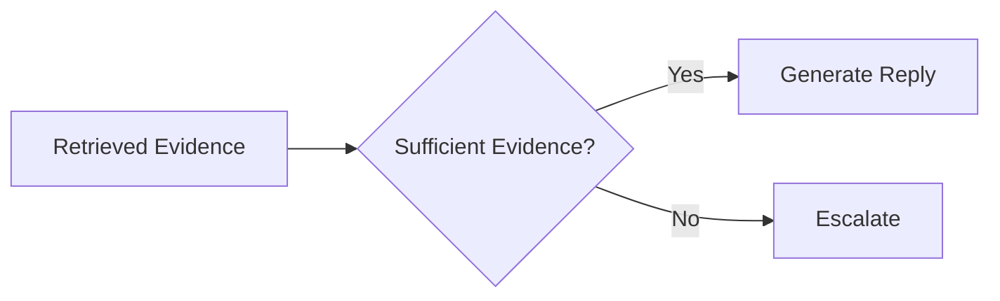

# DeltaSupportAgent — AI Customer Support Agent

> **Hiver SDE Intern Take-Home Assignment**
>
> A compact, evidence-grounded support agent built from the **Customer Support on Twitter** dataset. The system classifies incoming customer messages, retrieves historically similar support interactions, drafts a grounded reply, and decides whether the case should be escalated to a human.

---

## 1. What I built

The goal was not to build a generic chatbot. It was to answer three operational questions:

1. **What kind of support request is this?**
2. **Can we draft a response grounded in how this brand historically handled similar cases?**
3. **Should the agent handle it automatically, or should a human take over?**

The implementation deliberately keeps the system small and inspectable:

- **5 data-derived intent classes**
- **TF-IDF + cosine similarity** for historical retrieval
- **Top-3 historical conversations** as evidence
- **Two-stage LLM pipeline:** route first, draft second
- **Strict JSON routing output**
- **Fail-safe escalation**
- **200-example hand-labelled golden set**
- **Trivial + keyword baselines**
- **LLM-as-a-Judge evaluation**
- **Human calibration study on 25 examples**
- **Local fallback engine** using Qwen2.5-0.5B-Instruct

The central design principle is:

> **The proof is worth more than the system.**

The README therefore reports both what works and where the headline metrics are misleading.

---

## 2. Results at a glance

### Golden-set evaluation

| Metric | Agent | Trivial baseline | Keyword baseline |
|---|---:|---:|---:|
| Intent accuracy | **72.0%** | 37.0% | 39.0% |
| Intent macro F1 | **69.1%** | 10.8% | 32.6% |
| Escalation accuracy | **78.0%** | 54.5% | 55.0% |
| Escalation precision | **84.9%** | 54.5% | 73.2% |
| Escalation recall | **72.5%** | 100.0% | 27.5% |
| Escalation F1 | **78.2%** | 70.6% | 40.0% |

**Dataset:** 200 hand-labelled examples.  
**Agent completion:** 200/200 = 100%.  
**LLM judge:** 107 replies scored, mean **4.71/5**, median **5/5**.

The agent materially outperforms both simple baselines on intent classification and gives a much more balanced escalation policy than either baseline.

---

## 3. Problem framing

The source data contains real customer-support conversations from Twitter. Rather than inventing a taxonomy first, I grouped the observed requests into a small set of operational classes that can support routing and response generation.

### Intent taxonomy

| Intent | What it captures |
|---|---|
| `Flight_Status_and_Upgrades` | Flight status, delays, upgrades, schedules and related travel-status questions |
| `Baggage_and_Amenities` | Baggage, lounges, food, onboard amenities and related service questions |
| `Refunds_and_Complaints` | Refund requests, compensation, complaints and negative service issues |
| `Praise_and_Feedback` | Compliments, thanks and positive/general feedback |
| `Needs_Context_or_DM` | Cases where the public message does not contain enough information to safely resolve the issue |

The fifth class is particularly important operationally: **lack of context is itself a reason not to automate aggressively.**

---

## 4. System architecture



### Pipeline

1. **Input:** customer message.
2. **Router:** predicts one of the five intents and an escalation decision.
3. **Escalation branch:** if escalation is required, return the reason and do not draft an autonomous reply.
4. **Retrieval:** otherwise retrieve the three most similar historical customer/brand interactions.
5. **Generation:** draft a response using the retrieved historical evidence.
6. **Output:** customer-facing draft or human-handoff decision.

This separation matters because routing and generation have different failure modes. A model that writes fluent text is not automatically safe to let decide whether a case should be automated.

---

## 5. Historical retrieval

The retrieval layer uses:

- `TfidfVectorizer`
- cosine similarity
- `NearestNeighbors`
- `K = 3`

The historical corpus is built from the source conversations, but **golden-set examples are explicitly excluded from the retrieval corpus**.

This prevents a test example from simply retrieving itself or its near-duplicate labelled record.

The retrieved conversations are evidence, not instructions. The generator is prompted to use them to understand how similar cases were historically resolved rather than blindly copy text.

### Evidence flow



---

## 6. Two-stage decision pipeline

### Stage 1 — Route

The routing model returns strict JSON containing:

```json
{
  "intent": "Refunds_and_Complaints",
  "escalation": true,
  "reason": "The customer is requesting case-specific assistance that requires human context."
}
```

The parser is intentionally strict. If the model output cannot be safely interpreted, the system defaults toward escalation rather than silently guessing.

### Stage 2 — Draft

Only non-escalated cases proceed to response generation.

The generation prompt receives:

- the customer message
- the predicted intent
- retrieved historical conversations
- the instruction to remain grounded in those examples

This gives the system an explicit **evidence → answer** path instead of asking one model call to classify, decide and write everything at once.

---

## 7. Escalation and safety

The escalation decision is deliberately conservative.

Cases are more likely to escalate when they involve:

- insufficient identifying/contextual information
- case-specific account or booking details
- situations where the historical evidence does not provide a reliable answer
- ambiguous requests
- potentially unsafe or overconfident claims

There is also a deterministic guardrail layer around local inference.

### Fail-safe principle

If the system cannot confidently produce a valid routing result, **escalate rather than fabricate**.

Likewise, if a case is escalated, the system does not pretend that it completed a human-only action.

This is important for support automation because a polished but unsupported answer can be worse than no automated answer at all.

---

## 8. Cloud + local execution

The project supports two execution modes.

### Cloud engine

The primary cloud path uses **Groq** with `openai/gpt-oss-20b`.

Transient API failures such as rate limits and server errors are retried with exponential backoff and jitter.

### Local engine

The local fallback uses:

- `Qwen/Qwen2.5-0.5B-Instruct`
- PyTorch
- Transformers
- Accelerate

The local engine is intentionally small so the repository remains runnable on modest hardware.

The two engines share the same high-level routing/retrieval/generation structure, making the system usable even when the cloud API is unavailable.

---

## 9. Quickstart

### Requirements

- Python 3.10+
- Internet connection for the cloud engine
- A Groq API key for cloud inference
- For local inference: enough memory to load the small Qwen model

### Install

```bash
git clone <your-repository-url>
cd DeltaSupportAgent

python -m venv .venv

# Windows
.venv\Scripts\activate

# macOS/Linux
source .venv/bin/activate

pip install -r requirements.txt
```

### Configure Groq

Create a `.env` file:

```env
GROQ_API_KEY=your_key_here
```

Do not commit the `.env` file.

### Run

The repository's main agent entry point is:

```bash
python src/agent.py
```

Use the local/cloud configuration exposed by the repository when you want to switch inference engines.

---

## 10. Reproducing the evaluation

The repository contains the golden set and evaluation artifacts used for the reported results.

The intended evaluation flow is:

```bash
python src/evaluate_agent.py
```

The evaluation produces structured results for:

- intent accuracy
- intent macro/weighted F1
- escalation accuracy
- escalation precision/recall/F1
- generated-response quality through the LLM judge

Existing results are cached/skipped where appropriate, which makes iterative development cheaper.

The latest recorded evaluation completed all 200 agent predictions with zero agent failures.

---

## 11. Golden set

The golden set contains **200 hand-labelled examples**, sampled from matched Delta conversations.

Sampling used a fixed random seed (`random_state=42`) for reproducibility.

Each example was labelled for:

- intent
- escalation decision
- escalation reason

### Why a golden set?

The training/source conversations are not enough to tell us whether the agent generalizes.

A held-out, hand-labelled set lets us evaluate:

- whether the taxonomy is actually learnable
- whether the model beats trivial heuristics
- whether routing mistakes are systematic
- whether escalation is too aggressive or too permissive

The golden examples are also excluded from retrieval to reduce evaluation leakage.

---

## 12. Baselines

Two deliberately simple baselines were implemented.

### Baseline 1 — Trivial

**Intent:** always predict `Praise_and_Feedback`.

**Escalation:** always escalate.

This baseline is intentionally weak but useful for checking that the learned system is doing more than exploiting class imbalance.

Results:

- Intent accuracy: **37.0%**
- Intent macro F1: **10.8%**
- Escalation accuracy: **54.5%**
- Escalation recall: **100%**
- Escalation F1: **70.6%**

The perfect escalation recall is not a success by itself: it comes from escalating every case.

### Baseline 2 — Keyword

A small hand-written keyword router looks for terms such as:

- `dm`
- `inbox`
- `delay`
- `refund`
- `bag`
- `lounge`
- `upgrade`

Results:

- Intent accuracy: **39.0%**
- Intent macro F1: **32.6%**
- Escalation accuracy: **55.0%**
- Escalation precision: **73.2%**
- Escalation recall: **27.5%**
- Escalation F1: **40.0%**

The keyword baseline illustrates why literal lexical matching is insufficient: customers can describe the same support problem using very different language.

---

## 13. Per-intent performance

| Intent | Precision | Recall | F1 | Support |
|---|---:|---:|---:|---:|
| Flight Status / Upgrades | 51.2% | 77.8% | 61.8% | 27 |
| Baggage / Amenities | 70.0% | 66.7% | 68.3% | 21 |
| Refunds / Complaints | 67.7% | 80.8% | 73.7% | 52 |
| Praise / Feedback | 98.1% | 70.3% | 81.9% | 74 |
| Needs Context / DM | 62.5% | 57.7% | 60.0% | 26 |

The strongest class by F1 is `Praise_and_Feedback`.

The weakest class by F1 is `Flight_Status_and_Upgrades`, where wording overlaps heavily with general travel/service requests.

---

# 14. Top failure modes

The headline accuracy is useful, but the errors are more informative.

## Failure mode 1 — Flight-status language overlaps with other travel requests

**Observed pattern:** messages mentioning delays, flights, schedules or upgrades can contain enough surrounding language to resemble broader complaints or service issues.

**Example pattern:** a customer describes a disrupted journey while also asking about an upgrade or flight status.

**Hypothesis:** the current five-class taxonomy compresses several related operational concepts into one bucket, making boundary cases inherently ambiguous.

**Next step:** add confusion-matrix-driven examples and test whether a small hierarchical router performs better.

---

## Failure mode 2 — “Needs Context / DM” is difficult to identify from text alone

Some messages look actionable but omit the booking, flight, case or account context needed to safely resolve them.

The model sometimes treats these as ordinary service requests instead of recognizing that the correct action is to request context or escalate.

**Hypothesis:** this is partly a classification problem and partly a missing-information detection problem. A dedicated “required fields present?” check may be more reliable than forcing all of it into the intent classifier.

---

## Failure mode 3 — Fluent replies can overclaim actions

A model may produce a natural-sounding response such as implying that a case has been forwarded, checked, arranged or otherwise acted upon when the agent has no tool that actually performed that action.

This is a serious support failure even if the wording sounds professional.

**Hypothesis:** generation models optimize for conversational completion and can infer an expected support workflow from historical examples.

**Mitigation:** explicitly forbid claims of completed actions unless the system has evidence that the action occurred.

---

## Failure mode 4 — Historically plausible advice can still be unhelpful

A retrieved response can be factually relevant to the topic but not address the customer's immediate need.

For example, generic website/app instructions may be inappropriate when the customer is dealing with an urgent flight disruption.

**Hypothesis:** retrieval optimizes similarity, not urgency or resolution quality.

**Next step:** rank evidence using both semantic similarity and operational attributes such as urgency, request type and resolution outcome.

---

## Failure mode 5 — Positive/general feedback can be overconfidently classified

`Praise_and_Feedback` has very high precision (**98.1%**) but lower recall (**70.3%**).

That means when the system predicts praise it is usually right, but many praise/feedback examples are still absorbed into other classes.

**Hypothesis:** positive feedback often contains additional service-specific terms, causing the router to focus on the topic rather than the customer's intent.

**Next step:** explicitly model speech act / sentiment as a secondary feature rather than relying only on topic classification.

---

# 15. LLM-as-a-Judge

Generated replies were evaluated with a rubric covering:

1. **Groundedness** — Is the answer supported by the retrieved/historical evidence?
2. **Helpfulness** — Does it actually address the customer's need?
3. **Tone** — Is it professional, natural and appropriate?
4. **Safety** — Does it avoid unsupported promises, risky claims or pretending actions happened?
5. **Overall** — Would this be acceptable as a support response?

The recorded judge results were:

- **107 replies scored**
- Mean: **4.71 / 5**
- Median: **5 / 5**

These scores are encouraging, but they are not treated as ground truth.

---

## 16. Human calibration of the judge

A separate human review was performed on **25 examples** to check whether the LLM judge was directionally aligned with human judgement.

The completed sample produced:

- Human mean overall score: **3.88 / 5**
- LLM mean overall score: **4.28 / 5**
- Mean LLM − human difference: **+0.40**
- Exact agreement: **32%**
- Agreement within ±1 point: **80%**
- Spearman correlation: **0.36**
- Quadratic weighted Cohen's κ: **0.33**

### Interpretation

The judge is **useful as a scalable screening signal, but clearly not a substitute for human evaluation**.

The LLM judge tends to score responses more generously than the human reviewer. More importantly, only 32% of the ratings exactly matched, while 80% were within one point.

This validates the decision to report the judge separately rather than presenting `4.71/5` as if it were objective truth.

---

# 17. What is misleading about my headline number?

The most tempting headline is:

> **“72% intent accuracy and 4.71/5 response quality.”**

That is incomplete.

### 1. Intent accuracy hides class imbalance

`Praise_and_Feedback` has 74 examples, while some other classes have only 21–27.

That is why macro F1 (**69.1%**) is also reported.

### 2. A 4.71/5 LLM-judge score is not human ground truth

The 25-example human calibration shows a meaningful gap:

> LLM mean: **4.28** vs human mean: **3.88**

So the judge appears somewhat optimistic.

### 3. Routing quality and response quality are different

A high-quality response is irrelevant if the system should have escalated the case.

The escalation metrics therefore need to be considered alongside intent accuracy and response quality.

### 4. The system is not solving every support problem

The taxonomy is intentionally small and data-derived.

Real customer support contains cases outside these five buckets, and those should not be hidden by forcing them into the nearest class.

### 5. Retrieval similarity is not the same as evidence quality

TF-IDF can find lexically similar historical examples that are not necessarily the best resolution precedent.

The system therefore needs continued validation on real failure cases.

**The honest headline is:**

> **The prototype reaches 72% intent accuracy and 78.2% escalation F1 on a 200-example hand-labelled golden set, while its 4.71/5 LLM-judge response score is only a proxy and is calibrated against a smaller human sample.**

---

# 18. What I would do with one more week

## Day 1–2: Improve the dataset

- Expand the golden set around the current confusion pairs.
- Add more difficult `Needs_Context_or_DM` examples.
- Annotate whether the historical response actually resolved the issue.
- Add an explicit “unsupported claim” label for generated responses.

## Day 3: Improve retrieval

Compare:

- TF-IDF
- sentence embeddings
- hybrid lexical + semantic retrieval

Measure retrieval separately before changing the generator.

## Day 4: Improve routing

Test a hierarchical decision:

```text
Customer message
      |
      +--> enough context? ---- no ---> escalate
      |
     yes
      |
      +--> topic / intent
```

This directly separates missing-information detection from topic classification.

## Day 5: Improve generation safety

Add structured constraints:

- never claim an action was performed without tool evidence
- never invent policy details
- never invent booking/account information
- prefer asking for missing context over guessing

## Day 6: Better evaluation

Increase human review and compare:

- LLM judge
- human rating
- groundedness-specific errors
- escalation errors

The objective would be to understand **which metric predicts real support usefulness**, not simply maximize a judge score.

## Day 7: Productization

Add:

- structured logs
- confidence scores
- retrieval evidence in the operator UI
- explicit human-handoff reason
- evaluation dashboard
- latency/cost measurements

---

# 19. Engineering decision log

| Decision | Why |
|---|---|
| Five intent classes | Small enough to be operationally useful and grounded in observed dataset patterns |
| TF-IDF retrieval | Fast, transparent and easy to reproduce |
| Top-3 retrieval | Gives the generator multiple precedents without overwhelming the prompt |
| Exclude golden examples from retrieval | Reduces evaluation leakage |
| Two-stage router + generator | Separates safety-critical routing from response writing |
| Strict JSON routing | Makes model output machine-checkable |
| Fail-safe escalation | Safer than silently guessing when parsing/routing fails |
| Draft only after non-escalation | Prevents the system from simultaneously recommending human handoff and fabricating a resolution |
| Groq cloud engine | Fast inference path with a practical API interface |
| Qwen local fallback | Keeps the project runnable without relying entirely on an external API |
| Retry transient cloud errors | Improves robustness to temporary 429/5xx failures |
| Trivial baseline | Establishes a minimum bar |
| Keyword baseline | Tests whether the LLM system beats simple lexical heuristics |
| LLM judge | Scales response-quality evaluation beyond manual review |
| Human calibration | Checks whether the judge's scores are trustworthy enough to interpret |
| Report limitations explicitly | Prevents benchmark numbers from being mistaken for production readiness |

---

# 20. Limitations

This is a prototype, not a production customer-support system.

### Data limitations

The golden set is only 200 examples. It is large enough to expose meaningful errors, but not enough to establish production-level reliability.

### Taxonomy limitations

Five classes are useful for this assignment but necessarily compress a much richer support space.

### Retrieval limitations

TF-IDF is lexical. Synonyms and paraphrases can be missed.

### Generation limitations

The LLM can still produce plausible but unsupported language, especially when historical responses imply actions or policies.

### Evaluation limitations

The LLM judge is not ground truth and was calibrated on only 25 human-reviewed examples.

### Operational limitations

There is no live airline backend, CRM, booking system or authenticated customer context. The agent therefore cannot safely perform or verify account-specific actions.

---

# 21. Repository structure

```text
DeltaSupportAgent/
├── data/
│   ├── delta_golden_set_labeled.csv
│   └── ...
├── src/
│   ├── agent.py
│   ├── evaluate_agent.py
│   ├── baselines.py
│   └── ...
├── evaluation_results.csv
├── evaluation_summary.json
├── requirements.txt
└── README.md
```

The exact repository contents may evolve as the project is iterated; the evaluation artifacts are retained so headline results remain inspectable.

---

# 22. Reproducibility checklist

Before submitting, verify:

- [ ] `requirements.txt` installs successfully
- [ ] `.env` is not committed
- [ ] the golden set is present
- [ ] the golden set is excluded from retrieval
- [ ] the evaluation script runs end-to-end
- [ ] the reported metrics match the saved evaluation summary
- [ ] the baselines are included
- [ ] the LLM-judge rubric is documented
- [ ] human calibration results are retained
- [ ] failure examples are inspectable
- [ ] the README stays within the requested report length when rendered

---

# 23. Final takeaway

This project is intentionally less ambitious than a production support platform.

The important result is not that an LLM can generate plausible customer-service language. It is that a small, reproducible pipeline can:

**classify → retrieve evidence → decide whether to escalate → generate only when appropriate**

and can be evaluated against both simple baselines and human judgement.

The current system reaches:

- **72.0% intent accuracy**
- **69.1% intent macro F1**
- **78.2% escalation F1**
- **100% evaluation completion**
- **4.71/5 LLM-judge mean**

while the evaluation also exposes why those numbers should **not** be treated as production readiness.

The next iteration should focus less on making the model more fluent and more on **better evidence, better escalation boundaries, and better human-aligned evaluation**.
